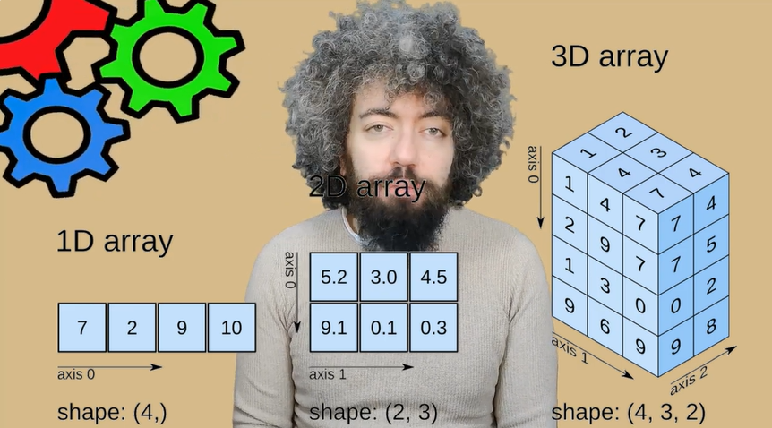
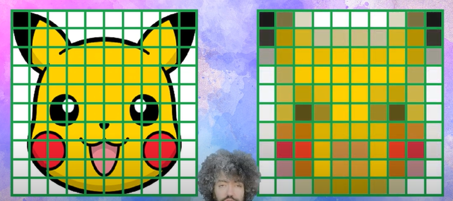
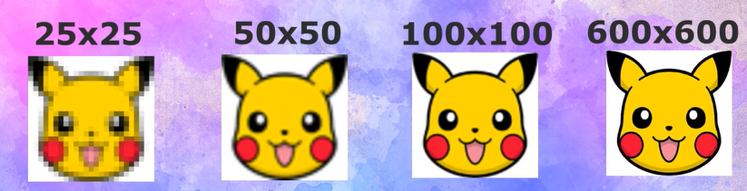
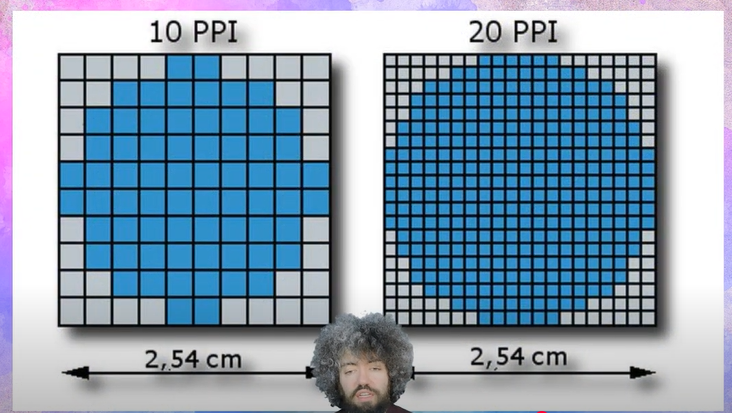
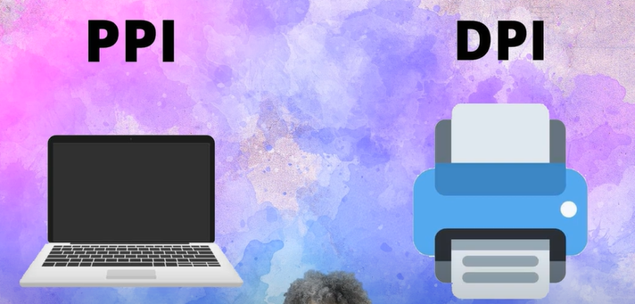

# Image Processing (Görüntü İşleme)

Görüntü İşleme, görüntüyü dijital fon haline getirip bazı işlemlerle spesifik bir görüntü elde edilen yeni görüntüden bazı yararlı bilgiler almak.

Girdi görütü, çıktı görüntünün isteilen ya da dikkat edilmesi gereken bölümüne karşılık gelen parça, kesit.

Örnek uygulamlar: Yüz tanımla, göz tanımlama, yeşil renk filtresi, Turuncu renk filtresi, Ten renk filtresi, araç taımlama

## OpenCV (Open Source Computer Vision)

1999'da Intel tarafından geliştirmeye başlanmış. Daha sonra NVIDIA, AMD, Google tarafıdan da desteklenmiş.

İlk etapta C dili geliştirilmeye başlanmış. Daha sonra birçok algoritması C++ dilinde geliştirilmiş.

Özellikleri:

- Open Source
- BSD Lisansı(istenen projede ücretsiz kullanılabilir)
- Platform bağımsız (Windows, Linux, Mac,.. vb.)
- C, C++, Python, Java, MAtlab, C#, Perl, Ruby, Javascript
- Görüntü işleme ve makine öğrenmesi için 1500'den fazla algoritma bulunur. Bu algoritmalar aşağıdaki projelerde kullanılabilir:
  - Yüz tanıma
  - Nesneleri ayırt etme
  - Hareket tespiti
  - Nesne Sınıflandırma
  - Plaka Tanımlama
  - 3D görüntüde işlem yapabilme
  - Görüntü karşılaştırma
  - Optik karakter tanımlama

OpenCV Bileşenleri:

- CORE: OpenCV'nin temel fonksiyonları ve matris, point, size gibi veri
  yapılarını bulundurur. Ayrıca görüntü üzerine çizim yapabilmek için
  kullanılabilecek metotları ve XML işlemleri için gerekli bileşenleri barındırır.

- HIGHGUI: Resim görüntüleme, pencereleri yönetme ve grafiksel kullanıcı arabirimleri için gerekli olabilecek metotları barındırır.

- IMGPROC: Filtreleme operatörleri, kenar bulma, nesne belirleme, renk uzayı yönetimi,renk yönetimi ve eşikleme gibi neredeyse tüm fonksiyonları içine alan bir pakettir.

- IMGCODECS: Dosya sistemi üzerinden resim ve video okuma/yazma işlemlerini yerine getiren metotları barındırır.

- VIDEOIO: Kameralara ve video cihazlarına erişmek, görüntü almak ve görüntü yazmak için gerekli metotları barındırır.

## Numpy (Numerical Python)

Çok boyutlu diziler ve matrislerle çalışmamızı sağlayan Python kütüphanelerinden birisi.

ÖZellikleri:

- Açık kaynak ve numeric
- Çok boyutlu dizi ve matris
- Numeric ve Numarray
- Rastgele sayı üreteçleri
- Matematiksel, cebirsel ve istatistiksel operasvonlar

## Pandas

Veri işleme ve analizi için Pyhton dilinde yazılmış bir kütüphane.

Zaman etiketli serileri ve sayısal tabloları işlemek için bir veri yapısı oluşturur. Bu şekilde dışıl işlemler bu veri yapısı üzerinde yapılabilir hale gelir.

Özellikleri:

- İndeksli DataFrame (veri iskeleti) objeleri ile veri işleyebilmesi.
- Hafızadaki veya farklı türlerde bulunan veriyi okuyabilmek ve
  yazabilmek için araçlar sağlaması.
- Veri sıralama ve bütünleşik kayıp veri senaryolarına karşı esnek imkanlar sunması.
- Veri setlerinin tekrar boyutlandırılması veya döndürülmesi.
- Etiket bazlı dilimleme, özel indeksleme ve büyük veri setlerini ayrıştırma özelliği.
- Veri iskeletine sütun ekleme veya var olan sütunu çıkarabilmesi.
- Veri gruplama özelliği ile ayırma-uygulama-birleştirme uygulamalarının yapılabilmesi.
- Veri setlerinin birleştirilmesi ve birbirine eklenmesi.
  Hiyerarşik eksenleri indeksleme özelliğiyle birlikte çok boyutlu veriden, daha az boyutlu veri elde edilebilmesi.
- Zaman aralığı oluşturma ve sıklık çevrimleri yapma, hareketli aralık istatistik fonksiyonları, tarih öteleme ve geciktirme.
- Veri filtrelemesi.

## Matplotlib

Veri görselleştirmesi için kullanılan Pyhton dilinde yazılmış bir kütüphane.

Görselleştirmeler karmaşık bir sorunu, verideki ilişkileri, yapıları ve ayrıkı değerleri tespit etmemize olanak sağlar

## Pixel (Picture Element)

Piksel, insan gözünün dijital cihazların ekranlarıda ayırt edebileceği en küçük birim.

(7x7 yani 49 piksele indirgenmiş Pikachu resmi)

- Piksel sayısı arttıkça görüntü kalitesi artar.

  

## PPI (Piksel Yoğunğu)

Bir inç yani 2,54 cm'ye düşen piksel saysısını verir.

- PPI değeri yükseldikçe ekrandaki görüntünün keskinliği artar

## DPI (İnç başıan düşen nokta sayısı)

- PPI, dijital ekranlar; DPI, baskı teknikleri ile ilgili bir terim.

## Gözümüzün Direkt Beyne Aktardığı Görüntü Kaç Piksel?

İnsan gözünün aslıda bir sınırı yoktur. Dolayısıyla **bir kare pencere üzerinde sınırladığımızı düşünürsek görüntünün beyne aktardığı piksel sayısı 324 MegaPiksel'dir.**

- **Herhangi bir çerçeve sınırı olmadığını düşündüğümüzde bu değer 576 MegaPiksel'e kadar çıkabilmektedir.**

(1 MP = 1 Milyon piksel)

## Source

[Image Processing Course by Burak Kocaaslan](https://youtube.com/playlist?list=PLP6TjrWzAOA1wkUS_0GDWjk0dBWC6z_Ru&si=hyXEH0Pf1Sj2Iam2)
